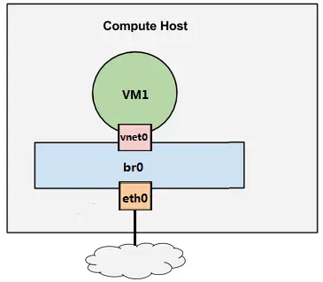
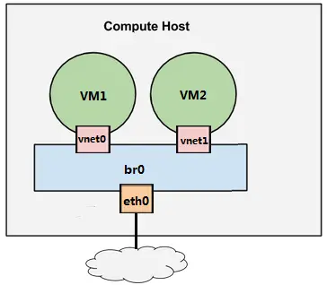

# OpenStack 学习笔记

## 虚拟化

### 什么是虚拟化

虚拟化是云计算的基础。是一种将物理计算资源（如CPU，内存，存储，网络等）抽象化并分割为多个独立、隔离的虚拟环境的技术。使得一台物理服务器上可以运行多个虚拟机（VM）或容器，每个虚拟机都拥有自己的操作系统和应用程序。

> 物理机一般称为宿主机（Host），虚拟机一般称为客户机（Guest）

虚拟化主要通过一个叫 **Hypervisor** 的程序实现

### Hypervisor

> Hypervisor 是所有虚拟化技术的核心,是提供底层机器虚拟化的软件层

#### hypervisor 分类

> 根据hypervisor的实现方式，可以分为两大类
> 

##### Type-I（裸金属型/Bare-Metal）

Type-I Hypervisor 直接安装在物理机上，多个虚拟机在 Hypervisor 上运行。
裸金属虚拟化中Hypervisor 直接管理调用硬件资源，不需要底层操作系统.
可以理解为Type-I Hypervisor 实现方式一般是一个特殊定制的 Linux 系统。
Xen 和 VMWare 的 ESXi 都属于这个类型

##### Type-II 型（宿主型/Hosted）

物理机上首先安装常规的**操作系统**，比如 Redhat、Ubuntu 和 Windows。
Hypervisor 作为 OS 上的一个程序模块运行，并对管理虚拟机进行管理。
KVM、VirtualBox 和 VMWare Workstation 都属于这个类型。

### KVM(Kernel-Based Virtual Machine)

> KVM是Linux内核原生的开源虚拟化解决方案，允许将Linux内核直接转换为一个Type I Hypervisor，利用硬件虚拟化扩展实现高效的虚拟机管理。

#### 核心组件

1. 内核模块（kvm.ko）
   提供CPU和内存的虚拟化功能，直接调用硬件虚拟化指令（如Intel VT-x/AMD-V）。
   负责虚拟机的创建、调度和资源隔离。
2. Qemu
   实现IO虚拟化与各设备模拟（磁盘、网卡、显卡、声卡等），通过IOCTL系统调用与KVM内核交互。
   通过kvm加速模式（-enable-kvm）与KVM内核模块结合，实现高效虚拟化。

#### Libvirt


简单说就是 KVM 的管理工具。

其实，Libvirt 除了能管理 KVM 这种 Hypervisor，还能管理 Xen，VirtualBox 等。OpenStack 底层也使用 Libvirt，所以很有必要学习一下。

Libvirt 包含 3 个东西：后台 daemon 程序 libvirtd、API 库和命令行工具 virsh

libvirtd是服务程序，接收和处理 API 请求；

API 库使得其他人可以开发基于 Libvirt 的高级工具，比如 virt-manager，这是个图形化的 KVM 管理工具，后面我们也会介绍；

virsh 是经常要用的 KVM 命令行工具

### CPU和内存虚拟化
#### CPU虚拟化
KVM的CPU虚拟化需要CPU硬件支持（通过Intel VT-x/AMD-V实现的）  
  
查看CPU是否支持虚拟化指令集，可以使用如下命令：
```
egrep -o '(vmx|svm)'  /proc/cpuinfo
# 正确输出为 vmx 或 svm
```
一个 KVM 虚机在宿主机中其实是一个 qemu-kvm 进程，与其他 Linux 进程一样被调度。 
可以通过在宿主机中使用 top 或 ps 命令查看 qemu-kvm 进程。


虚机中的每一个虚拟 vCPU 则对应 qemu-kvm 进程中的一个线程

宿主机有两个物理 CPU，上面起了两个虚机 VM1 和 VM2。 VM1 有两个 vCPU，VM2 有 4 个 vCPU。可以看到 VM1 和 VM2 分别有两个和 4 个线程在两个物理 CPU 上调度。

> 虚机的 vCPU 总数可以超过物理 CPU 数量，这个叫 CPU overcommit（超配）。 
> KVM 允许 overcommit
### 内存虚拟化
KVM 的内存虚拟化是通过内存页共享实现的。

为了在一台机器上运行多个虚拟机，KVM 需要实现 VA（虚拟内存） -> PA（物理内存） -> MA（机器内存）之间的地址转换。  
虚机 OS 控制虚拟地址到客户内存物理地址的映射 （VA -> PA），但是虚机 OS 不能直接访问实际机器内存，因此 KVM 需要负责映射客户物理内存到实际机器内存 （PA -> MA）。

### KVM存储虚拟化
KVM 的存储虚拟化是通过存储池（Storage Pool）和卷（Volume）来管理的。

Storage Pool 是宿主机上可以看到的一片存储空间，可以是多种类型。
Volume 是在 Storage Pool 中划分出的一块空间，宿主机将 Volume 分配给虚拟机，Volume 在虚拟机中看到的就是一块硬盘。

#### 目录类型的Strorage Pool
文件目录是最常用的Storage Pool类型。  
KVM将宿主机目录/var/lib/libvirt/images/ 作为默认的 Storage Pool  
Volume 就是该目录下面的文件了，一个文件就是一个 Volume。  

使用文件做 Volume 有很多优点：存储方便、移植性好、可复制、可远程访问

#### LVM类型的Storage Pool
> 物理卷（PV）：是物理磁盘或分区，可以是整个硬盘或者硬盘的一部分。
> 卷组（VG）：由多个物理卷组成，可以看作是PV的集合。
> 逻辑卷（LV）：VG中画出来的一块逻辑磁盘


不仅一个文件可以分配给客户机作为虚拟磁盘，宿主机上 VG 中的 LV 也可以作为虚拟磁盘分配给虚拟机使用。  
不过，LV 由于没有磁盘的 MBR 引导记录，不能作为虚拟机的启动盘，只能作为数据盘使用。
宿主机上的 VG 就是一个 Storage Pool，VG 中的 LV 就是 Volume。   
LV 的优点是有较好的性能；不足的地方是管理和移动性方面不如镜像文件，而且不能通过网络远程使用。 

#### 其他类型的Storage Pool
KVM 还支持 iSCSI，Ceph 等多种类型的 Storage Pool

### KVM网络虚拟化
> 网络虚拟化是虚拟化技术中最复杂的部分，学习难度最大
#### Linux Bridge
假设宿主机有 1 块与外网连接的物理网卡 eth0，上面跑了 1 个虚机 VM1，现在有个问题是：如何让 VM1 能够访问外网？

至少有两种方案：

1. 将物理网卡eth0直接分配给VM1，但随之带来的问题很多： 宿主机就没有网卡，无法访问了； 新的虚机，比如 VM2 也没有网卡。 下面看推荐的方案。

2. 给 VM1 分配一个虚拟网卡 vnet0，通过 Linux Bridge  br0 将 eth0 和 vnet0 连接起来，如下图所示：

Linux Bridge 是 Linux 上用来做 TCP/IP 二层协议交换的设备，其功能大家可以简单的理解为是一个二层交换机或者 Hub。多个网络设备可以连接到同一个 Linux Bridge，当某个设备收到数据包时，Linux Bridge 会将数据转发给其他设备。

现在我们增加一个虚机 VM2，如下图所示：


现在 VM1 和 VM2 之间可以通信，同时 VM1 和 VM2 也都可以与外网通信

### virbr0
> virbr0 是 KVM 默认创建的一个 Bridge，其作用是为连接其上的虚机网卡提供 NAT 访问外网的功能。

### VLAN

### 云计算与OpenStack
OpenStack is a cloud operating system that controls large pools of compute, storage, and networking resources throughout a datacenter, all managed through a dashboard that gives administrators control while empowering their users to provision resources through a web interface.

## Openstack 核心
### OpenStack 架构
### Keystone
### Glance
### Nova
### Neutron
### Cinder
