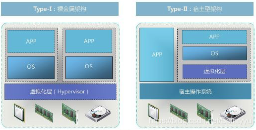
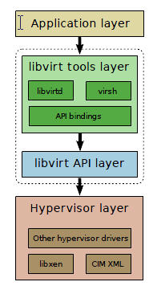

# OpenStack 学习笔记

## 虚拟化

### 什么是虚拟化

虚拟化是云计算的基础。是一种将物理计算资源（如CPU，内存，存储，网络等）抽象化并分割为多个独立、隔离的虚拟环境的技术。使得一台物理服务器上可以运行多个虚拟机（VM）或容器，每个虚拟机都拥有自己的操作系统和应用程序。

> 物理机一般称为宿主机（Host），虚拟机一般称为客户机（Guest）

虚拟化主要通过一个叫 **Hypervisor** 的程序实现

### Hypervisor

> Hypervisor 是所有虚拟化技术的核心,是提供底层机器虚拟化的软件层

#### hypervisor 分类

> 根据hypervisor的实现方式，可以分为两大类
> 

##### Type-I（裸金属型/Bare-Metal）

Type-I Hypervisor 直接安装在物理机上，多个虚拟机在 Hypervisor 上运行。
裸金属虚拟化中Hypervisor 直接管理调用硬件资源，不需要底层操作系统.
可以理解为Type-I Hypervisor 实现方式一般是一个特殊定制的 Linux 系统。
Xen 和 VMWare 的 ESXi 都属于这个类型

##### Type-II 型（宿主型/Hosted）

物理机上首先安装常规的**操作系统**，比如 Redhat、Ubuntu 和 Windows。
Hypervisor 作为 OS 上的一个程序模块运行，并对管理虚拟机进行管理。
KVM、VirtualBox 和 VMWare Workstation 都属于这个类型。

### KVM(Kernel-Based Virtual Machine)

> KVM是Linux内核原生的开源虚拟化解决方案，允许将Linux内核直接转换为一个Type I Hypervisor，利用硬件虚拟化扩展实现高效的虚拟机管理。

#### 核心组件

1. 内核模块（kvm.ko）
   提供CPU和内存的虚拟化功能，直接调用硬件虚拟化指令（如Intel VT-x/AMD-V）。
   负责虚拟机的创建、调度和资源隔离。
2. Qemu
   实现IO虚拟化与各设备模拟（磁盘、网卡、显卡、声卡等），通过IOCTL系统调用与KVM内核交互。
   通过kvm加速模式（-enable-kvm）与KVM内核模块结合，实现高效虚拟化。

#### Libvirt

简单说就是 KVM 的管理工具。

其实，Libvirt 除了能管理 KVM 这种 Hypervisor，还能管理 Xen，VirtualBox 等。OpenStack 底层也使用 Libvirt，所以很有必要学习一下。

Libvirt 包含 3 个东西：后台 daemon 程序 libvirtd、API 库和命令行工具 virsh

libvirtd是服务程序，接收和处理 API 请求；

API 库使得其他人可以开发基于 Libvirt 的高级工具，比如 virt-manager，这是个图形化的 KVM 管理工具，后面我们也会介绍；

virsh 是经常要用的 KVM 命令行工具

### CPU和内存虚拟化

### KVM存储虚拟化

### LVM类型的Storage Pool

### KVM网络虚拟化

### virbr0

### VLAN

### 云计算与OpenStack
