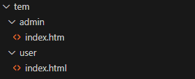

# GIN学习笔记

## gin路由

### 基本路由

路由（Routing）是由一个 URI（或者叫路径）和一个特定的 HTTP 方法（GET、POST 等）
组成的，涉及到应用如何响应客户端对某个网站节点的访问。

> gin 框架中采用的路由库是基于httprouter做的

```
package main

import (
    "net/http"

    "github.com/gin-gonic/gin"
)

func main() {
    r := gin.Default()
    r.GET("/", func(c *gin.Context) {
        c.String(http.StatusOK, "hello word")
    })
    r.POST("/xxxpost",getting)
    r.PUT("/xxxput")
    //监听端口默认为8080
    r.Run(":8000")
}
```

### RESTful风格 API

> gin支持Restful风格的API

RESTful即Representational State Transfer的缩写。直接翻译的意思是"表现层状态转化"，是一种互联网应用程序的API设计理念：URL定位资源，用HTTP描述操作

```
1.获取文章 /blog/getXxx Get blog/Xxx

2.添加 /blog/addXxx POST blog/Xxx

3.修改 /blog/updateXxx PUT blog/Xxx

4.删除 /blog/delXxxx DELETE blog/Xxx
```

### API参数

> 可以通过Context的Param方法来获取API参数(路径中的参数)

```
func main() {
    r := gin.Default()
    r.GET("user/:name/*path", func(c *gin.Context) {
		name := c.Param("name")
		path := c.Param("path")
		fmt.Println(name, path)
		c.String(http.StatusOK, name+path)
	})
    //默认为监听8080端口
    r.Run(":8000")
}
```

### URL参数

> URL参数可以通过DefaultQuery()或Query()方法获取
> DefaultQuery()若参数不存在，返回默认值，Query()若不存在，返回空串
> 示例 http://139.159.160.149:8000/user?name=pexlor

```
r.GET("/user", func(c *gin.Context) {
    // name := c.Query("name")
    name := c.DefaultQuery("name", "pexlor")
    c.String(http.StatusOK, name)
})
```

### 表单(form)参数

> 表单传输为post请求
> 表单参数可以通过PostForm()方法获取
> 示例：建议使用HTTP接口在线测试模拟POST请求

```
r.POST("/form", func(c *gin.Context) {
    types := c.DefaultPostForm("type", "post")
    username := c.PostForm("username")
    password := c.PostForm("password")
    c.String(http.StatusOK, types+username+password)
})
```

### 上传单个文件

> multipart/form-data格式用于文件上传

```
func main() {
    r := gin.Default()
    //限制上传最大尺寸
    r.MaxMultipartMemory = 8 << 20
    r.POST("/upload", func(c *gin.Context) {
        file, err := c.FormFile("file")
        if err != nil {
            c.String(500, "上传图片出错")
        }
        // c.JSON(200, gin.H{"message": file.Header.Context})
        c.SaveUploadedFile(file, file.Filename)
        c.String(http.StatusOK, file.Filename)
    })
    r.Run()
}
```

### 上传多个文件

```
func main() {
   // 1.创建路由
   // 默认使用了2个中间件Logger(), Recovery()
   r := gin.Default()
   // 限制表单上传大小 8MB，默认为32MB
   r.MaxMultipartMemory = 8 << 20
   r.POST("/upload", func(c *gin.Context) {
      form, err := c.MultipartForm()
      if err != nil {
         c.String(http.StatusBadRequest, fmt.Sprintf("get err %s", err.Error()))
      }
      // 获取所有图片
      files := form.File["files"]
      // 遍历所有图片
      for _, file := range files {
         // 逐个存
         if err := c.SaveUploadedFile(file, file.Filename); err != nil {
            c.String(http.StatusBadRequest, fmt.Sprintf("upload err %s", err.Error()))
            return
         }
      }
      c.String(200, fmt.Sprintf("upload ok %d files", len(files)))
   })
   //默认端口号是8080
   r.Run(":8000")
}
```

### 路由组

> routes group是为了管理一些相同的URL

#### 简单路由组

```
func main() {
    router := gin.Default()
    //简单的路由组: v1
    v1 := router.Group("/v1")
    {
        v1.POST("/login", loginEndpoint)
        v1.POST("/submit", submitEndpoint)
        v1.POST("/read", readEndpoint)
    }
    //简单的路由组: v2
    v2 := router.Group("/v2")
    {
        v2.POST("/login", loginEndpoint)
        v2.POST("/submit", submitEndpoint)
        v2.POST("/read", readEndpoint)
    }
    router.Run(":8080")
}
```

#### 路由文件分组

> MVC架构路由分层

```
// 新建adminRoutes.go
package routes
import (
    "net/http"
    "github.com/gin-gonic/gin"
)
funcAdminRoutesInit(router *gin.Engine) {
    adminRouter := router.Group("/admin")
    {
        adminRouter.GET("/user", func(c *gin.Context) {
            c.String(http.StatusOK, "用户")
        })
        adminRouter.GET("/news", func(c *gin.Context) {
            c.String(http.StatusOK, "news")
        })
    }
}
```

### 路由原理

> httproter会将所有路由规则构造一颗前缀树

## 数据解析和绑定

### ShouldBind()

> 可以基于请求的Content-Type识别请求数据类型并利用反射机制自动提取请求中QueryString、form表单、JSON、XML等
> 参数到结构体中

> ShouldBind()强大的功能，它能够基于请求自动提取JSON、form表单和QueryString 类型的数据

```
//注意首字母大写
type Userinfo struct {
    // binding:"required"修饰的字段，若接收为空值，则报错，是必须字段
    User    string `form:"username" json:"user" uri:"user" xml:"user" binding:"required"`
    Pssword string `form:"password" json:"password" uri:"password" xml:"password" binding:"required"`
}
```

### Json数据解析和绑定

> c.ShouldBindJSON(&json)

```
func main() {
   // 1.创建路由
   // 默认使用了2个中间件Logger(), Recovery()
   r := gin.Default()
   // JSON绑定
   r.POST("loginJSON", func(c *gin.Context) {
      // 声明接收的变量
      var json Login
      // 将request的body中的数据，自动按照json格式解析到结构体
      if err := c.ShouldBindJSON(&json); err != nil {
         // 返回错误信息
         // gin.H封装了生成json数据的工具
         c.JSON(http.StatusBadRequest, gin.H{"error": err.Error()})
         return
      }
      // 判断用户名密码是否正确
      if json.User != "root" || json.Pssword != "admin" {
         c.JSON(http.StatusBadRequest, gin.H{"status": "304"})
         return
      }
      c.JSON(http.StatusOK, gin.H{"status": "200"})
   })
   r.Run(":8000")
}
```

### 表单数据解析和绑定

> c.Bind(&form)

```
func main() {
    // 1.创建路由
    // 默认使用了2个中间件Logger(), Recovery()
    r := gin.Default()
    // JSON绑定
    r.POST("/loginForm", func(c *gin.Context) {
        // 声明接收的变量
        var form Login
        // Bind()默认解析并绑定form格式
        // 根据请求头中content-type自动推断
        if err := c.Bind(&form); err != nil {
            c.JSON(http.StatusBadRequest, gin.H{"error": err.Error()})
            return
        }
        // 判断用户名密码是否正确
        if form.User != "root" || form.Pssword != "admin" {
            c.JSON(http.StatusBadRequest, gin.H{"status": "304"})
            return
        }
        c.JSON(http.StatusOK, gin.H{"status": "200"})
    })
    r.Run(":8000")
}
```

### URI数据解析和绑定

> c.ShouldBindUri(&login)

```
func main() {
    // 1.创建路由
    // 默认使用了2个中间件Logger(), Recovery()
    r := gin.Default()
    // JSON绑定
    r.GET("/:user/:password", func(c *gin.Context) {
        // 声明接收的变量
        var login Login
        // Bind()默认解析并绑定form格式
        // 根据请求头中content-type自动推断
        if err := c.ShouldBindUri(&login); err != nil {
            c.JSON(http.StatusBadRequest, gin.H{"error": err.Error()})
            return
        }
        // 判断用户名密码是否正确
        if login.User != "root" || login.Pssword != "admin" {
            c.JSON(http.StatusBadRequest, gin.H{"status": "304"})
            return
        }
        c.JSON(http.StatusOK, gin.H{"status": "200"})
    })
    r.Run(":8000")
}
```

### URL参数解析和绑定

> ShouldBindQuery()

```
r.GET("/user", func(c *gin.Context) {
    var user User
    if err := c.ShouldBindQuery(&user); err != nil {
        c.JSON(http.StatusBadRequest, gin.H{"error": err.Error()})
        return
    }
    c.JSON(http.StatusOK, gin.H{"message": "User info is valid", "user": user})
})

```

## gin渲染

### 各种数据格式响应

1. json

```
funcmain() {
    r := gin.Default()
    // gin.H是map[string]interface{}的缩写
    r.GET("/someJSON", func(c *gin.Context) {
        //方式一：自己拼接JSON
        c.JSON(http.StatusOK, gin.H{"message": "Helloworld!"})
    })
    r.GET("/moreJSON", func(c *gin.Context) {
        //方法二：使用结构体
        varmsg struct {
            Name string `json:"user"`
            Message string
            Age int
        }
        msg.Name = "Pexlor"
        msg.Message = "Helloworld!"
        msg.Age =18
        c.JSON(http.StatusOK,msg)
    })
    r.Run(":8080")
}
```

2. JSONP

```
r.GET("/JSONP", func(c *gin.Context) {
    data :=map[string]interface{}{
        "foo": "bar",
    }
    // /JSONP?callback=x
    //将输出：x({\"foo\":\"bar\"})
    c.JSONP(http.StatusOK, data)
})

```

3. XML

```
// gin.H是map[string]interface{}的缩写
r.GET("/someXML", func(c *gin.Context) {
    //方式一：自己拼接JSON
    c.XML(http.StatusOK, gin.H{"message": "Helloworld!"})
})

r.GET("/moreXML", func(c *gin.Context) {
    //方法二：使用结构体
    typeMessageRecord struct {
        Name string
        Message string
        Age int
    }
    varmsgMessageRecord
    msg.Name = "Pelxor"
    msg.Message = "Helloworld!"
    msg.Age =18
    c.XML(http.StatusOK,msg)
})
```

4. HTML(渲染模版)

```
router.GET("/", func(c *gin.Context) {
    c.HTML(http.StatusOK, "default/index.html",map[string]interface{}{
        "title": "前台首页"
    })
})
```

5. ProtoBuf

```
r.GET("/someProtoBuf", func(c *gin.Context) {
    reps := []int64{int64(1), int64(2)}
    // 定义数据
    label := "label"
    // 传protobuf格式数据
    data := &protoexample.Test{
        Label: &label,
        Reps:  reps,
    }
    c.ProtoBuf(200, data)
})
```

6. String

```
r.GET("/news", func(c *gin.Context) {
    aid := c.Query("aid")
    c.String(200, "aid=%s", aid)
})
```

### HTML模版渲染

> gin支持加载HTML模板, 然后根据模板参数进行配置并返回相应的数据，本质上就是字符串替换
> 先使用 LoadHTMLGlob() 或者 LoadHTMLFiles() 方法加载模板

#### 全部模板放在一个目录里面的配置方法


```
<!DOCTYPE html>
<html lang="en">
<head>
    <meta charset="UTF-8">
    <meta name="viewport" content="width=device-width, initial-scale=1.0">
    <meta http-equiv="X-UA-Compatible" content="ie=edge">
    <title>{{.title}}</title>
</head>
    <body>
        fgkjdskjdsh{{.ce}}
    </body>
</html>
```

```
func main() {
    r := gin.Default()
    r.LoadHTMLGlob("tem/*") //要提前加载
    r.GET("/index", func(c *gin.Context) {
        c.HTML(http.StatusOK, "index.html", gin.H{"title": "我是测试", "ce": "123456"})
    })
    r.Run()
}
```

#### 模板放在不同目录里面的配置方法

> 要给每个模版定义名字 {{ define "admin/index.html" }}



```
{{ define "admin/index.html" }}
<!DOCTYPE html>
<html lang="en">
<head>
    <meta charset="UTF-8">
    <meta name="viewport" content="width=device-width, initial-scale=1.0">
    <meta http-equiv="X-UA-Compatible" content="ie=edge">
    <title>{{.title}}</title>
</head>
    <body>
        admin index{{.ce}}
    </body>
</html>
{{end}}
```

```
func main() {

	//创建默认路由引擎
	r := gin.Default()

	//配置模版的文件
	r.LoadHTMLGlob("tem/**/*")

    r.GET("/adminhtml", func(c *gin.Context) {
            c.HTML(http.StatusOK, "admin/index.html", gin.H{
                "title": "admin测试",
            })
        })

	r.GET("/userhtml", func(c *gin.Context) {
		c.HTML(http.StatusOK, "user/index.html", gin.H{
			"title": "user测试",
		})
	})
}
```

#### 自定义模版函数

```
func UnixToTime(timestamp int) string {
	fmt.Println(timestamp)
	t := time.Unix(int64(timestamp), 0)
	return t.Format("2006-01-02 15:04:05")
}

func main() {

	//创建默认路由引擎
	r := gin.Default()

	//注册全局模板函数注意顺序，注册模板函数需要在加载模板上面
	r.SetFuncMap(template.FuncMap{
		"UnixToTime": UnixToTime,
	})

    //配置模版的文件
	r.LoadHTMLGlob("tem/**/*")

	r.GET("/adminhtml", func(c *gin.Context) {
		c.HTML(http.StatusOK, "admin/index.html", gin.H{
			"title": "admin测试",
		})
	})

	r.Run(":8000")
}
```

在模版中使用

```
{{.now| formatDate}}
或者
{{formatDate .now }}
```

#### 静态文件服务

> 当我们渲染的HTML文件中引用了静态文件时,我们需要配置静态web服务

```
func main() {
    r := gin.Default()
    r.Static("/static", "./static") //前面的/static 表示路由后面的./static 表示路径
    r.LoadHTMLGlob("templates/**/*")
    // ...
    r.Run(":8080")
}
<link rel="stylesheet" href="/static/css/base.css" />
```

### 重定向

```
func main() {
    r := gin.Default()
    r.GET("/index", func(c *gin.Context) {
        c.Redirect(http.StatusMovedPermanently, "http://www.5lmh.com")
    })
    r.Run()
}
```

### 同步异步

> goroutine机制可以方便地实现异步处理
> 另外，在启动新的goroutine时，不应该使用原始上下文，必须使用它的只读副本

```
func main() {
    // 1.创建路由
    // 默认使用了2个中间件Logger(), Recovery()
    r := gin.Default()
    // 1.异步
    r.GET("/long_async", func(c *gin.Context) {
        // 需要搞一个副本
        copyContext := c.Copy()
        // 异步处理
        go func() {
            time.Sleep(3 * time.Second)
            log.Println("异步执行：" + copyContext.Request.URL.Path)
        }()
    })

    // 2.同步
    r.GET("/long_sync", func(c *gin.Context) {
        time.Sleep(3 * time.Second)
        log.Println("同步执行：" + c.Request.URL.Path)
    })

    r.Run(":8000")
```

## gin中间件

Gin 框架允许开发者在处理请求的过程中，加入用户自己的钩子（Hook）函数。这个钩子函数就叫中间件，中间件适合处理一些公共的业务逻辑，比如登录认证、权限校验、数据分页、记录日志、耗时统计等

> 通俗的讲：中间件就是匹配路由前和匹配路由完成后执行的一系列操作

### 局部中间件

```
// 定义中间
func MiddleWare() gin.HandlerFunc {
	return func(c *gin.Context) {
		t := time.Now()
		fmt.Println("中间件开始执行了,开始时间为：", t)
	}
}

func main() {
    //创建默认路由引擎
	r := gin.Default()

	//注册全局模板函数注意顺序，注册模板函数需要在加载模板上面
	r.SetFuncMap(template.FuncMap{
		"UnixToTime": UnixToTime,
	})

	//配置模版的文件
	r.LoadHTMLGlob("tem/**/*")

    r.GET("/adminhtml", MiddleWare(), func(c *gin.Context) {
		c.HTML(http.StatusOK, "admin/index.html", gin.H{
			"title": "admin测试",
		})
	})
}
```

### 全局中间件

> Use(middleware ...HandlerFunc)方法

```
// 定义中间
func MiddleWare() gin.HandlerFunc {
    return func(c *gin.Context) {
        t := time.Now()
        fmt.Println("中间件开始执行了,开始时间为:",t)
    }
}

func main() {
    // 1.创建路由
    // 默认使用了2个中间件Logger(), Recovery()
    r := gin.Default()
    // 注册中间件
    r.Use(MiddleWare())
    // {}为了代码规范
    {
        r.GET("/ce", func(c *gin.Context) {
            // 取值
            req, _ := c.Get("request")
            fmt.Println("request:", req)
            // 页面接收
            c.JSON(200, gin.H{"request": req})
        })

    }
    r.Run()
}
```

### Next()方法

> ctx.Next()调用该请求的剩余处理程序,就是会调用剩下的注册函数，等剩余函数执行完后再接着执行next()下方的内容

```
// 定义中间
func MiddleWare() gin.HandlerFunc {
	return func(c *gin.Context) {
		t := time.Now()
		fmt.Println("中间件开始执行了,开始时间为：", t)
        c.Next()
		t = time.Now()
		fmt.Println("中间件开始执行了,结束时间为：", t)
	}
}

func main() {
    //创建默认路由引擎
	r := gin.Default()

	//注册全局模板函数注意顺序，注册模板函数需要在加载模板上面
	r.SetFuncMap(template.FuncMap{
		"UnixToTime": UnixToTime,
	})

	//配置模版的文件
	r.LoadHTMLGlob("tem/**/*")

    r.GET("/adminhtml", MiddleWare(), func(c *gin.Context) {
		c.HTML(http.StatusOK, "admin/index.html", gin.H{
			"title": "admin测试",
		})
	})
}
```

### Abort()方法

> c.Abort()表示终止调用该请求的剩余处理程序

```
package main

import (
	"fmt"
	"net/http"
	"text/template"
	"time"

	"github.com/gin-gonic/gin"
)

type Article struct {
	Title string `json:"title"`
	Desc  string `json:"desc"`
}

type Userinfo struct {
	Username string `form:"username" json:"user"`
	Password string `form:"password" json:"password"`
}

func UnixToTime(timestamp int) string {
	fmt.Println(timestamp)
	t := time.Unix(int64(timestamp), 0)
	return t.Format("2006-01-02 15:04:05")
}

// 定义中间
func MiddleWareOne() gin.HandlerFunc {
	return func(c *gin.Context) {
		t := time.Now()
		fmt.Println("中间件1开始执行了,开始时间为：", t)
		c.Next()
		t = time.Now()
		fmt.Println("中间件1开始执行了,结束时间为：", t)
	}
}

// 定义中间
func MiddleWareTwo() gin.HandlerFunc {
	return func(c *gin.Context) {
		t := time.Now()
		fmt.Println("中间件2开始执行了,开始时间为：", t)
		c.Abort()
		t = time.Now()
		fmt.Println("中间件2开始执行了,结束时间为：", t)
	}
}

func main() {

	//创建默认路由引擎
	r := gin.Default()

	//注册全局模板函数注意顺序，注册模板函数需要在加载模板上面
	r.SetFuncMap(template.FuncMap{
		"UnixToTime": UnixToTime,
	})

	//配置模版的文件
	r.LoadHTMLGlob("tem/**/*")

	r.GET("/adminhtml", MiddleWareOne(), MiddleWareTwo(), func(c *gin.Context) {
		c.HTML(http.StatusOK, "admin/index.html", gin.H{
			"title": "admin测试",
		})
	})


	r.Run(":8000")
}

```

这里最后的控制器函数没有执行，没有返回数据

### 路由分组配置中间件

两种写法

写法一:

```
shopGroup := r.Group("/shop", MiddleWare())
{
    shopGroup.GET("/index", func(c *gin.Context) {...})
    ...
}

```

写法二:

```
shopGroup := r.Group("/shop")
shopGroup.Use(MiddleWare())
{
    shopGroup.GET("/index", func(c *gin.Context) {...})
    ...
}
```

### 中间件和对应控制器之间共享数据

> 设置值 ctx.Set("username", "张三")
> 获取值 username, _ := ctx.Get("username")

中间件设置值

```
func InitAdminMiddleware(ctx *gin.Context) {
    fmt.Println("路由分组中间件")
    //可以通过ctx.Set在请求上下文中设置值，后续的处理函数能够取到该值
    ctx.Set("username", "张三")
    // 调用该请求的剩余处理程序
    ctx.Next()
}
```

控制器获取值

```
func (c UserController) Index(ctx *gin.Context) {
    username, _ := ctx.Get("username")
    fmt.Println(username)
    ctx.String(http.StatusOK, "这是用户首页 111")
}
```

### 中间件注意事项

1. gin默认中间件
   gin.Default()默认使用了 Logger 和 Recovery 中间件，其中：

   • Logger中间件将日志写入gin.DefaultWriter，即使配置了GIN_MODE=release。• Recovery 中间件会recover任何panic。如果有panic的话，会写入500响应码。

   如果不想使用上面两个默认的中间件，可以使用gin.New()新建一个没有任何默认中间件的
   路由。
2. gin中间件中使用goroutine
   当在中间件或handler中启动新的goroutine时，不能使用原始的上下文（c*gin.Context），必须使用其只读副本（c.Copy()）

```
r.GET("/", func(c *gin.Context) {
    cCp := c.Copy()
    go func() {
        // simulate a long task with time.Sleep(). 5 seconds
        time.Sleep(5 * time.Second)
        // 这里使用你创建的副本
        fmt.Println("Done! in path " + cCp.Request.URL.Path)
    }()
    c.String(200, "首页")
}
```

## 会话控制

### Cookie

#### 介绍

HTTP是无状态协议，服务器不能记录浏览器的访问状态，也就是说服务器不能区分两次请求是否由同一个客户端发出
Cookie就是解决HTTP协议无状态的方案之一，中文是小甜饼的意思
Cookie实际上就是服务器保存在浏览器上的一段信息。浏览器有了Cookie之后，每次向服务器发送请求时都会同时将该信息发送给服务器，服务器收到请求后，就可以根据该信息处理请求
Cookie由服务器创建，并发送给浏览器，最终由浏览器保存
测试服务端发送cookie给客户端，客户端请求时携带cookie

#### 使用

> 设置cookie  c.SetCookie(name, value string, maxAge int, path, domain string, secure, httpOnly bool)
> 第一个参数 key
> 第二个参数 value
> 第三个参数 maxAge ,过期时间.如果只想设置Cookie的保存路径而不想设置存活时间，可以在第三个参数中传递nil
> 第四个参数 path ,cookie的路径
> 第五个参数 domain ,cookie的路径Domain作用域 本地调试配置成 localhost, 正式上线配置成域名
> 第六个参数 secure ，当 secure 值为 true 时，cookie 在 HTTP 中是无效，在 HTTPS 中才有效
> 第七个参数 httpOnly，是微软对COOKIE做的扩展。如果在COOKIE中设置了“httpOnly”属性，则通过程序（JS脚本、applet等）将无法读取到COOKIE信息，防止XSS攻击产生

> 获取cookie  cookie, err := c.Cookie("name")

```
func main() {
    r := gin.Default()
    r.SetFuncMap(template.FuncMap{
        "unixToDate": models.UnixToDate,
    })
    r.GET("/", func(c *gin.Context) {
        c.SetCookie("usrename", "张三", 3600, "/", "localhost", false, true)
        c.String(200, "首页")
    })

    r.GET("/user", func(c *gin.Context) {
        username, _ := c.Cookie("usrename")
        c.String(200, "用户-"+username)
    })
    r.Run(":8080")
}
```

#### 多个二级域名共享cookie

1. 分别把a.itying.com 和 b.itying.com 解析到我们的服务器
2. 我们想的是用户在a.itying.com 中设置Cookie 信息后在b.itying.com 中获取刚才设置的cookie，也就是实现多个二级域名共享cookie

```
c.SetCookie("usrename", "张三", 3600, "/", ".itying.com", false, true)
```

#### 缺点

不安全，明文
增加带宽消耗
可以被禁用
cookie有上限

### Sessions

#### 简单介绍

session 是另一种记录客户状态的机制，不同的是Cookie保存在客户端浏览器中，而session保存在服务器上。

#### 使用

> Gin 官方没有给我们提供Session相关的文档，这个时候我们可以使用第三方的Session中间件( gin-contrib/sessions )来实现
> gin-contrib/sessions中间件支持的存储引擎：
> • cookie
> • memstore
> • redis
> • memcached
> • mongodb

#### 基于Cookie存储Session

> 安装session包 goget github.com/gin-contrib/sessions

```
package main
import (
    "github.com/gin-contrib/sessions"
    "github.com/gin-contrib/sessions/cookie"
    "github.com/gin-gonic/gin"
)

func main() {
    r := gin.Default()
    //创建基于cookie的存储引擎，secret11111参数是用于加密的密钥
    store := cookie.NewStore([]byte("secret11111"))
    //设置session中间件，参数mysession，指的是session的名字，也是cookie的名字
    // store是前面创建的存储引擎，我们可以替换成其他存储引擎
    r.Use(sessions.Sessions("mysession", store))
    r.GET("/", func(c *gin.Context) {
        //初始化session对象
        session := sessions.Default(c)
        //设置过期时间
        session.Options(sessions.Options{
            MaxAge: 3600 *6, // 6hrs
        })
        //设置Session
        session.Set("username", "张三")
        session.Save()
        c.JSON(200, gin.H{"msg": session.Get("username")})
    })

    r.GET("/user", func(c *gin.Context) {
        //初始化session对象
        session := sessions.Default(c)
        //通过session.Get读取session值
        username := session.Get("username")
        c.JSON(200, gin.H{"username": username})
    })
    r.Run(":8000")
}
```

#### 基于Redis存储Session

> 安装redis存储引擎的包 goget github.com/gin-contrib/sessions/redis

```
package main
import (
    "github.com/gin-contrib/sessions"
    "github.com/gin-contrib/sessions/redis"
    "github.com/gin-gonic/gin"
)
func main() {
    r := gin.Default()
    //初始化基于redis的存储引擎
    //参数说明：
    //第1个参数-redis最大的空闲连接数
    //第2个参数-数通信协议tcp或者udp
    //第3个参数-redis地址,格式，host:port
    //第4个参数-redis密码
    //第5个参数-session加密密钥
    store, _ := redis.NewStore(10, "tcp", "localhost:6379", "", []byte("secret"))
    r.Use(sessions.Sessions("mysession", store))

    r.GET("/", func(c *gin.Context) {
        session := sessions.Default(c)
        session.Set("username", "李四")
        session.Save()
        c.JSON(200, gin.H{"username": session.Get("username")})
    })
  
    r.GET("/user", func(c *gin.Context) {
        // 初始化session 对象
        session := sessions.Default(c)
        // 通过session.Get 读取 session 值
        username := session.Get("username")
        c.JSON(200, gin.H{"username": username})
    })
    r.Run(":8000")
}
```

# 源码学习

# 面试题
